# LLM Cost & Token Estimator

> See how many tokens your prompt uses — and what it'll cost on **GPT-4o vs. Claude vs. Gemini** — right inside VS Code. No API key, no billing dashboard, no guessing.

[](https://github.com/waqarulwahab/llm-cost-estimator/actions/workflows/ci.yml)
[](CHANGELOG.md)
[](LICENSE)

## Why this exists

When you're building an LLM-powered app, two questions come up constantly: _how
many tokens is this prompt?_ and _what will this call cost?_ Today you either
guess, paste into a web tokenizer, or check the provider's billing console after
the fact — all of which pull you out of your editor.

This extension answers both questions **inline**, and it answers them for
**several models at once**, so you can make a real price/quality trade-off
("~$X on GPT-4o, ~$Y on Claude Sonnet, ~$Z on Claude Haiku") without leaving the
file you're working in. It's local-first and works with zero configuration — no
API key required.

## Demo



> Hover any prompt (or select text) to see its token count and cost across your
> models, side by side — cheapest first. Same comparison powers the CodeLens, the
> live status bar, and the Comparison Panel.

<!-- NOTE: the animated SVG renders on GitHub. The VS Code Marketplace blocks SVG
in READMEs, so before publishing, also record a real screen-capture GIF/PNG and
reference that here for the Marketplace listing. -->


## Features

- **🔀 Multi-model cost comparison** — token count + estimated cost across all
  your configured models, side by side. This is the whole point.
- **🛈 Hover tooltip** — hover over a selection or a string literal (JS/TS/Python,
  plus Markdown/JSON/YAML/plaintext) to see the comparison inline.
- **🔎 CodeLens on prompts** — a token-count + cost lens appears right above
  detected prompt strings in your code. Click it for the full breakdown.
- **📊 Live status bar** — select any text and its token count + cost appear in
  the status bar instantly (no command needed); the tooltip shows every model.
- **🗔 Comparison Panel** — a visual dashboard comparing the **whole catalog**
  with a live **output-token slider** (recomputes instantly), sortable columns,
  and a "configured models only" filter.
- **⌨️ Commands** — `Estimate Selection`, `Estimate Clipboard`, `Open Comparison
  Panel`, and `Select Models to Compare`.
- **🗂 25+ models** — GPT-4o/4.1/o-series, Claude 4/3.7/3.5, Gemini 2.5/2.0/1.5,
  DeepSeek, Mistral, Llama, Grok. Pick what you care about.
- **📁 Workspace scan** — one command finds every prompt in your project and
  reports the total estimated cost per run, with a clickable per-file breakdown.
- **➕ Custom models** — add your own models/prices (or a negotiated rate) in
  settings; no need to edit bundled files.
- **⚠️ Context-window warnings** — a `⚠` appears when a prompt exceeds a model's
  context window.
- **📋 Copy as Markdown** — drop a ready-to-paste comparison table on your
  clipboard.
- **🔒 Local-first, zero config** — exact OpenAI tokenization runs entirely on
  your machine; pricing is bundled. No network calls, no API key.

### A note on accuracy

- **OpenAI** models use **real** BPE tokenization (`o200k_base` for the GPT-4o
  family, `cl100k_base` for GPT-4 / GPT-3.5) via
  [`js-tiktoken`](https://github.com/dqbd/tiktoken).
- **Anthropic, Google, and everyone else** (DeepSeek, Mistral, Llama, Grok, …)
  do not publish reliable local tokenizers, so their counts are **approximated**
  using an OpenAI encoding and are clearly marked with a `~` and a disclaimer in
  the UI. They're great for ballpark cost comparison, not for exact billing. (An
  optional API-based accurate mode is a candidate for a future release.)

## Also available as an MCP server (use it in Claude / Cursor)

This repo also ships an **[MCP server](mcp-server/)** that exposes the same
tokenizer + pricing engine as tools (`estimate_cost`, `count_tokens`,
`list_models`) to Claude Desktop, Claude Code, Cursor, or any MCP client — so you
can ask _"what does this prompt cost on GPT-4o vs Claude vs Gemini?"_ right in
your chat. See **[mcp-server/README.md](mcp-server/README.md)** for setup. Same
local-first, no-API-key core — just a different front end.

## Install

**From the Marketplace** (once published):

1. Open the Extensions view (`Ctrl+Shift+X` / `Cmd+Shift+X`).
2. Search for **"LLM Cost & Token Estimator"**.
3. Click **Install**.

**From a `.vsix`:**

```bash
code --install-extension llm-cost-estimator-0.3.1.vsix
```

**From source (for development):** see [Contributing](#contributing).

## Usage

- **Hover:** hover over a string literal — or select text — in a supported file.
  A tooltip shows the per-model token count and cost.
- **CodeLens:** open a JS/TS/Python file with prompt strings; a `N tokens · ~$X ·
  compare` lens sits above each one. Click it for the full breakdown.
- **Live status bar:** select any text — the status bar instantly shows its token
  count and cheapest cost; hover the item for the full comparison. Click it to
  open the Comparison Panel.
- **Comparison Panel:** Command Palette → **LLM Cost: Open Comparison Panel** (or
  the editor toolbar icon). Drag the **output-token slider** to see costs update
  live, sort by any column, or filter to your configured models.
- **Commands** (Command Palette, `Ctrl+Shift+P`):
  - **LLM Cost: Estimate Selection** — selection, or the whole file if nothing is
    selected. Also on the editor right-click menu.
  - **LLM Cost: Estimate Clipboard** — estimate whatever you've copied.
  - **LLM Cost: Open Comparison Panel** — the visual dashboard.
  - **LLM Cost: Scan Workspace for Prompts** — project-wide prompt cost report.
  - **LLM Cost: Copy Comparison as Markdown** — table to clipboard.
  - **LLM Cost: Select Models to Compare** — pick models from the catalog.
  - **LLM Cost: Reset Session Total** — clear the running total.

> **How "total" is calculated:** cost = input tokens + an _assumed_ number of
> output tokens (output pricing is usually higher than input, so it matters).
> The assumption is configurable and always shown in the tooltip.
>
> ```
> cost = (inputTokens  / 1e6) * inputPer1M
>      + (outputTokens / 1e6) * outputPer1M
> ```

## Settings

All settings live under `llmCostEstimator.*`:

| Setting | Type | Default | Description |
| --- | --- | --- | --- |
| `llmCostEstimator.models` | `string[]` | `["gpt-4o", "claude-sonnet", "claude-haiku"]` | Models to compare. Each entry must be a key in [`pricing.json`](src/pricing/pricing.json). |
| `llmCostEstimator.outputTokenAssumption` | `number` | `500` | Assumed output (completion) tokens used for the total-cost calculation. |
| `llmCostEstimator.currency` | `string` | `"USD"` | Currency label shown next to costs. Display only — does **not** convert (pricing is in USD). |
| `llmCostEstimator.enableHover` | `boolean` | `true` | Show the hover tooltip. |
| `llmCostEstimator.enableCodeLens` | `boolean` | `true` | Show a CodeLens above detected prompt strings (JS/TS/Python). |
| `llmCostEstimator.enableStatusBarSelection` | `boolean` | `true` | Show the live token count + cost of the current selection in the status bar. |
| `llmCostEstimator.customModels` | `object` | `{}` | Add or override models without editing `pricing.json` (see [Custom models](#custom-models)). |

**Available model keys** (out of the box) — run **LLM Cost: Select Models to
Compare** to pick from these visually:

- **OpenAI:** `gpt-4o`, `gpt-4o-mini`, `gpt-4.1`, `gpt-4.1-mini`, `gpt-4.1-nano`,
  `o3`, `o4-mini`, `gpt-4-turbo`, `gpt-4`, `gpt-3.5-turbo`
- **Anthropic:** `claude-opus`, `claude-sonnet`, `claude-haiku`,
  `claude-3.7-sonnet`, `claude-3.5-sonnet`, `claude-3-opus`
- **Google:** `gemini-2.5-pro`, `gemini-2.5-flash`, `gemini-2.0-flash`,
  `gemini-1.5-pro`, `gemini-1.5-flash`
- **Others:** `deepseek-chat`, `deepseek-reasoner`, `mistral-large`,
  `mistral-small`, `llama-3.3-70b`, `llama-3.1-405b`, `grok-2`

Example `settings.json`:

```jsonc
{
  "llmCostEstimator.models": ["gpt-4o", "gpt-4o-mini", "claude-sonnet", "gemini-1.5-flash"],
  "llmCostEstimator.outputTokenAssumption": 800,
  "llmCostEstimator.currency": "USD"
}
```

### Custom models

Add your own models — or override a built-in price with a negotiated rate —
without touching the bundled files, via `llmCostEstimator.customModels`:

```jsonc
{
  "llmCostEstimator.customModels": {
    "my-finetune": {
      "label": "My Fine-tune",
      "provider": "openai", // "openai" = exact tokenization; anything else = estimate
      "inputPer1M": 1.0,
      "outputPer1M": 2.0,
      "contextWindow": 128000 // optional, enables the ⚠ over-limit warning
    },
    "gpt-4o": { "label": "GPT-4o (our rate)", "provider": "openai", "inputPer1M": 2.0, "outputPer1M": 8.0 }
  }
}
```

Then add the key to `llmCostEstimator.models` (or pick it via **Select Models to
Compare**). Invalid entries are reported and skipped, not silently dropped.

## Updating pricing

> ⚠️ **The bundled prices are representative placeholders and change
> frequently. Verify them against each provider's official pricing page before
> relying on them.**
>
> - OpenAI — <https://openai.com/api/pricing/>
> - Anthropic — <https://www.anthropic.com/pricing>
> - Google — <https://ai.google.dev/pricing>

Prices live in [`src/pricing/pricing.json`](src/pricing/pricing.json), keyed by
model alias. Each entry looks like:

```json
"gpt-4o": {
  "label": "GPT-4o",
  "provider": "openai",
  "encoding": "o200k_base",
  "inputPer1M": 2.5,
  "outputPer1M": 10.0
}
```

- `inputPer1M` / `outputPer1M` are **USD per 1,000,000 tokens**.
- `provider` is `openai`, `anthropic`, or `google` (determines the tokenizer and
  whether the count is exact or an estimate).
- `encoding` is the BPE used to count tokens — `o200k_base` or `cl100k_base`.
  For Anthropic/Google it's only an approximation proxy.

To add a model or change a price, edit the JSON and rebuild
(`npm run compile`). The pricing file is bundled into the extension, so changes
take effect after a rebuild/reinstall. Pull requests that keep prices current
are very welcome.

## Contributing

Contributions are welcome — bug reports, pricing updates, new providers, and
features alike.

```bash
git clone https://github.com/waqarulwahab/llm-cost-estimator.git
cd llm-cost-estimator
npm install

npm test           # run unit + load tests (Vitest)
npm run test:load  # just the load/performance suite
npm run e2e        # bundle + end-to-end test against a mocked VS Code
npm run lint       # ESLint
npm run typecheck  # tsc --noEmit
npm run compile    # bundle to dist/ with esbuild
```

Then press **F5** in VS Code to launch the **Extension Development Host** and try
your changes live.

**Project layout:**

```
src/
  tokenizer/   # Tokenizer interface + per-provider implementations
  pricing/     # pricing.json + lookup & cost math
  core/        # estimator, prompt detector, workspace scan, export, formatting (all pure)
  ui/          # hover, status bar, CodeLens, QuickPick, comparison + scan webviews
  commands/    # command handlers
  extension.ts # activate() / deactivate()
test/          # Vitest unit + load tests for the core logic
mcp-server/    # MCP server (reuses src/core, src/pricing) — use it in Claude/Cursor
```

The `core/`, `tokenizer/`, and `pricing/` layers are intentionally free of any
`vscode` import so they can be unit-tested directly.

This project is licensed under the [MIT License](LICENSE).

## Packaging & publishing

The extension is bundled with [esbuild](https://esbuild.github.io/) and packaged
with [`@vscode/vsce`](https://github.com/microsoft/vscode-vsce); the MCP server is
published to npm. Both are automated via GitHub Actions on a version tag.

```bash
npm run package       # production bundle -> dist/extension.js
npm run vsce:package  # create the .vsix
npm run mcp:build     # build the MCP server
npm run mcp:test      # build + stdio end-to-end test the MCP server
```

👉 **Full step-by-step guide — Marketplace, Open VSX, npm, GitHub Actions,
secrets, and how end users install each artifact — is in
[PUBLISHING.md](PUBLISHING.md).**

---

Built with [`js-tiktoken`](https://github.com/dqbd/tiktoken). Not affiliated with
OpenAI, Anthropic, or Google.
